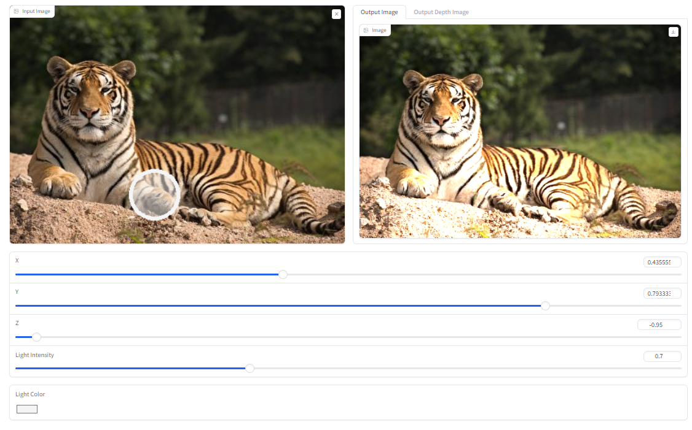

# Add Light

This project aims to use open-source depth estimation models to adding light sources that were not originally present in the scene and show the results on web page.

## Overview

The goal of this project is to provide a solution for augmenting images with additional light sources using [Depth Anything](https://github.com/fabio-sim/Depth-Anything-ONNX) ,Blinn-Phong model and OpenGL for rendering. Users can interact with the web interface based on Gradio, upload their images, and preview the enhanced results in real-time.

## Requirements
- Onnx Runtime
- OpenCV
- Gradio
- PyOpenGL
- pyglfw

## Usage

## Remark
- If you can't run PyOpenGL on Windows, please check [this](https://stackoverflow.com/questions/65699670/pyopengl-opengl-error-nullfunctionerror-attempt-to-call-an-undefined-functio/65699812#65699812)

- Since this project renders image by pyglfw, it does not support headless OS environment such as Google Colab

